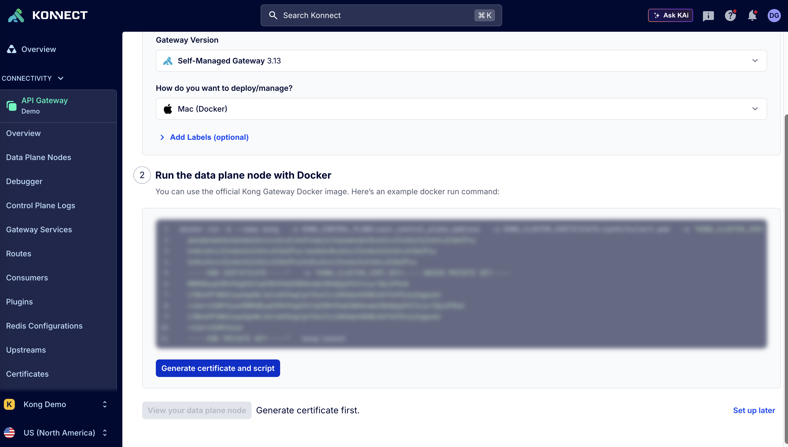

# Kong Gateway on AWS ECS

Deploy Kong Gateway data plane on AWS ECS Fargate, connected to Kong Konnect.

## Architecture

```
                    ┌─────────────────────────────────────────────────────┐
                    │                   Kong Konnect                       │
                    │              (Control Plane - Demo)                  │
                    └─────────────────────────┬───────────────────────────┘
                                              │ mTLS
                    ┌─────────────────────────┼───────────────────────────┐
                    │                   AWS VPC                            │
                    │                                                      │
                    │  ┌──────────────────────────────────────────────┐   │
                    │  │            Public Subnets (2 AZs)             │   │
                    │  │  ┌────────────────────────────────────────┐  │   │
Internet ──────────►│  │  │     Application Load Balancer          │  │   │
        :80/:443    │  │  └────────────────────┬───────────────────┘  │   │
                    │  └───────────────────────┼──────────────────────┘   │
                    │                          │ :8000                     │
                    │  ┌───────────────────────┼──────────────────────┐   │
                    │  │           Private Subnets (2 AZs)            │   │
                    │  │  ┌────────────────────▼───────────────────┐  │   │
                    │  │  │          ECS Fargate Service           │  │   │
                    │  │  │  ┌────────────┐  ┌────────────┐        │  │   │
                    │  │  │  │ Kong DP #1 │  │ Kong DP #2 │        │  │   │
                    │  │  │  └────────────┘  └────────────┘        │  │   │
                    │  │  └────────────────────────────────────────┘  │   │
                    │  └──────────────────────────────────────────────┘   │
                    └─────────────────────────────────────────────────────┘
```

## Prerequisites

1. AWS account with permissions for VPC, ECS, ALB, IAM, SSM
2. Terraform >= 1.0
3. Kong Konnect account

## Setup

### 1. Get Konnect Certificates

The easiest way to generate certificates is through the Konnect UI:

1. Log in to [Kong Konnect](https://cloud.konghq.com)
2. Go to **API Gateway** > Select your Control Plane
3. Click **Data Plane Nodes** in the left sidebar
4. Click **New Data Plane Node**
5. Select your Gateway version and deployment type (e.g., Mac/Docker)
6. Click the **"Generate certificate and script"** button



7. Copy the generated certificate and private key
8. Save them to:
   - `certs/tls.crt` - Certificate (the `cluster_cert` value)
   - `certs/tls.key` - Private key (the `cluster_cert_key` value)

Also copy the **control plane endpoint** and **telemetry endpoint** values - you'll need these for the next step.

### 2. Configure Variables

```bash
cp terraform.tfvars.example terraform.tfvars
```

Edit `terraform.tfvars` with your Konnect endpoints (from the same Data Plane Node page).

### 3. Deploy

```bash
terraform init
terraform plan
terraform apply
```

### 4. Verify

```bash
# Get the ALB URL
terraform output kong_endpoint

# Test Kong Gateway
curl $(terraform output -raw kong_endpoint)/status
```

The data plane should appear in Konnect under **Gateway Manager** > **Demo** > **Data Plane Nodes**.

## Resources Created

| Resource | Description |
|----------|-------------|
| VPC | 10.0.0.0/16 with 2 public + 2 private subnets |
| Internet Gateway | For public subnet internet access |
| NAT Gateway | For private subnet outbound access |
| ALB | Application Load Balancer (public) |
| ECS Cluster | Fargate cluster |
| ECS Service | 2 Kong data plane tasks |
| Security Groups | ALB (80/443), ECS (8000/8443) |
| IAM Roles | Task execution + task roles |
| SSM Parameters | Certificate storage (encrypted) |
| CloudWatch Logs | /ecs/{project_name}-kong |

## Cleanup

```bash
terraform destroy
```

## Cost Estimate

- NAT Gateway: ~$0.045/hour + data transfer
- ALB: ~$0.0225/hour + LCU charges
- ECS Fargate: ~$0.04/hour per task (512 CPU, 1GB)
- Estimated total: ~$100-150/month for POC

## Troubleshooting

### Data plane not connecting to Konnect

1. Check CloudWatch logs:
   ```bash
   aws logs tail /ecs/{project_name}-kong --follow
   ```

2. Verify certificates are correct (common issue: wrong format or expired)

3. Ensure NAT Gateway allows outbound 443 to Konnect

### Health checks failing

1. Verify security group allows ALB to reach ECS on port 8100 (status endpoint)
2. Check Kong is starting properly in logs
